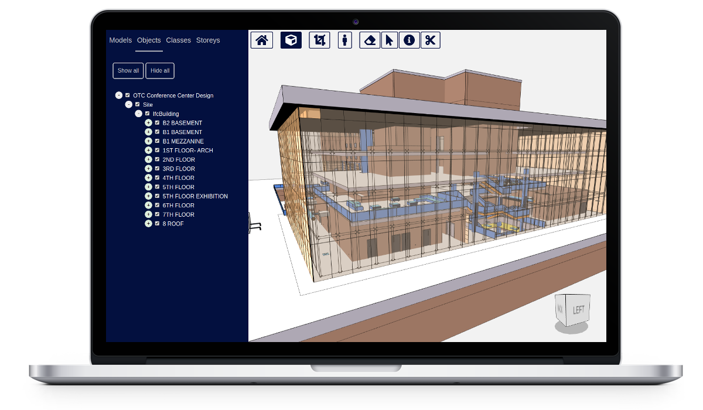

# xeokit-viewer

xeokit-viewer is an open source BIM model viewer built on the [xeokit SDK](http://xeokit.io). The viewer is developed for integration within [OpenProject's](https://www.openproject.org/) BIM construction project management software, but is also usable as a stand-alone viewer for your BIM models. 

[](https://xeokit.github.io/xeokit-viewer/index.html?project=OTCConferenceCenter&tab=storeys).

## Contents

  * [Contents](#contents)
  * [Features](#features)
  * [Demos](#demos)
  * [Roadmap](#roadmap)
  * [License](#license)
  * [Usage](#usage)
    + [Adding your own models](#adding-your-own-models)
    + [Customizing appearance](#customizing-appearance)
  * [Building](#building)
  
## Features

* Uses [xeokit SDK](https://xeokit.io) for fast loading and rendering of large models.
* Works in all major browsers, including mobile.
* Super fast loading and rendering for large numbers of objects.
* Loads BIM geometry and metadata from the file system.
* Loads multiple models.
* Supports IFC2x3 and IFC4.
* 3D and 2D viewing modes.
* Tree view with three hierarchy modes: containment, IFC type and storeys.
* X-ray, highlight, show, hide and slice objects. 
* Customize with your own CSS.
* Implemented in JavaScript (ES6), with no external dependencies (other than xeokit).

## Demos 

| Live Demo | Model Source |
|---|---|
| [OTC Conference Center](https://xeokit.github.io/xeokit-viewer/index.html?project=OTCConferenceCenter&tab=storeys) | [Details](http://openifcmodel.cs.auckland.ac.nz/Model/Details/301) |
| [Holter Tower](https://xeokit.github.io/xeokit-viewer/index.html?project=HolterTower&tab=storeys)| [Details](http://openifcmodel.cs.auckland.ac.nz/Model/Details/316) |
| [West Riverside Hospital](https://xeokit.github.io/xeokit-viewer/index.html?project=WestRiversideHospital&tab=models)| [Details](http://openifcmodel.cs.auckland.ac.nz/Model/Details/308) |
| [Schependomlaan](https://xeokit.github.io/xeokit-viewer/index.html?project=Schependomlaan&tab=storeys)| [Details](https://github.com/openBIMstandards/DataSetSchependomlaan) |
| [Duplex](https://xeokit.github.io/xeokit-viewer/index.html?project=Duplex&tab=storeys)| [Details](http://openifcmodel.cs.auckland.ac.nz/Model/Details/274) |

## Roadmap

- [x] Standalone viewer
- [ ] Integration into [OpenProject](https://www.openproject.org/)
- [ ] Save and load BCF viewpoints
- [ ] Measurement tools
- [ ] Memory usage monitoring
- [ ] Explode tool  
- [ ] Ambient shadows

Do you have feedback, or features you'd like to see in the viewer? Let us know in the [issue tracker](https://github.com/xeokit/xeokit-viewer/issues).  
  
## License

xeokit-viewer is bundled with the xeokit SDK, which is provided under an [Affero GPL V3](https://github.com/xeokit/xeokit-sdk/blob/master/LICENSE.txt) dual-license, which allows free use for non-commercial purposes, with the option to buy a licence for commercial use. Please [see here](https://xeokit.github.io/xeokit-licensing/) for commercial licensing options.

## Usage

### Adding your own models

TODO

### Customizing appearance

TODO

## Building 

Initialize:

````
sudo npm install
````

Building ES6 module in ````/dist/main.js````:

````
npm run build
````

Then, within ````index.hml````, we use the module like so:

````javascript
import {Server, ViewerUI} from "./dist/main.js";

const server = new Server({
    dataDir: "./data/"
});

const viewerUI = new ViewerUI(server, {
    //...
});
````